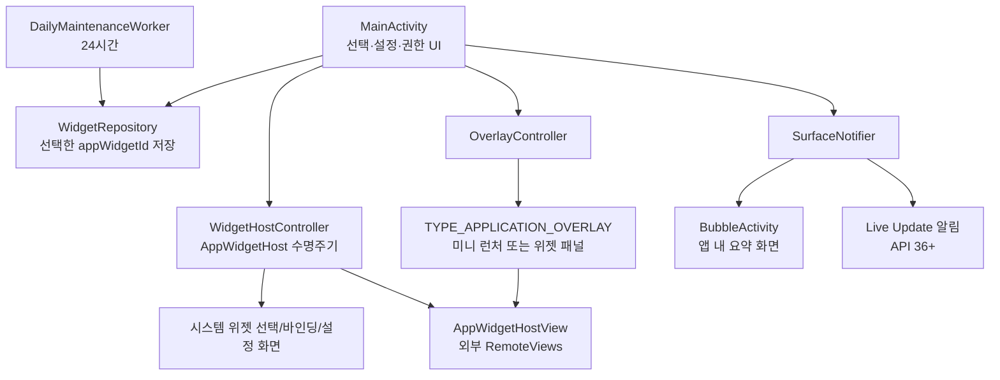

# Android 위젯 오버레이 프로토타입 구현 및 검증 계획

## 1. 목표와 범위

이 계획은 선택한 Android App Widget을 사용자가 요청할 때만 `TYPE_APPLICATION_OVERLAY` 창에 실제로 렌더링하고, 평소에는 작은 미니 런처를 제공하는 Android 네이티브 프로토타입을 구현하기 위한 것이다. 구현의 핵심은 위젯 제공자가 발행한 `RemoteViews`를 `AppWidgetHostView`로 호스팅하는 것이며, 앱이 위젯 내용을 복제하거나 백그라운드에서 무단 수집하지 않는다는 점이다.[1] [2]

버블과 Live Update는 같은 위젯 UI를 다른 시스템 표면으로 복제하는 기능이 아니다. 버블은 사용자가 시작한 앱 내 소형 작업의 진입점으로, Live Update는 사용자가 시작했고 끝이 분명한 진행 상황에만 사용할 수 있다.[3] [4] Samsung Now Bar는 직접 구현 대상이 아니라 Android Live Update가 해당 OEM 표면에 노출되는지를 검증하는 호환성 대상이다.

| 항목 | 프로토타입 포함 | 의도적으로 제외 |
|---|---|---|
| 외부 App Widget 선택·바인딩 | 포함 | 앱의 권한 없는 자동 바인딩 |
| 온디맨드 오버레이 | 포함 | 잠금화면 위 표시, 전체화면·입력 가로채기 |
| 드래그 가능한 미니 런처 | 포함 | 상시 포그라운드 서비스 |
| 버블 | 포함, 앱 자체 `BubbleActivity` | 외부 위젯을 버블의 항상 켜진 콘텐츠로 사용 |
| Live Update | 포함, API 36 이상에서 조건부 요청 | 커스텀 `RemoteViews` 기반 Live Update |
| 장주기 유지보수 | 포함, 24시간 `WorkManager` | 정확 알람·짧은 반복 폴링 |

## 2. 목표 아키텍처

| 컴포넌트 | 책임 | 주요 실패 처리 |
|---|---|---|
| `WidgetHostController` | ID 할당, 시스템 선택·바인딩·구성 흐름, 위젯 View 생성, 표시 중 리스닝 | 선택 취소·권한 거절 시 ID 해제 및 상태 초기화 |
| `WidgetRepository` | `SharedPreferences`에 단일 선택 `appWidgetId` 저장 | 저장 ID의 제공자가 사라진 경우 자동 삭제 |
| `OverlayController` | 미니 런처·위젯 패널을 `WindowManager`에 추가·이동·제거 | 오버레이 권한이 없으면 예외 없이 Activity 대체 표시 |
| `SurfaceNotifier` | 버블 요청과 Live Update 요청의 기능·권한·API 수준 검사 | 사용자 설정/OEM이 거부하면 일반 알림으로 하향 |
| `DailyMaintenanceWorker` | 24시간 주기의 선택 상태 유효성 점검 | 정확한 실행 시각에 의존하지 않으며 네트워크 접근 안 함 |

## 3. 구현 단계

### 3.1 프로젝트와 권한 구성

프로젝트는 Kotlin, Android Gradle Plugin, `compileSdk 36`, `minSdk 26`으로 구성한다. `SYSTEM_ALERT_WINDOW`, `POST_NOTIFICATIONS`, `POST_PROMOTED_NOTIFICATIONS`를 매니페스트에 선언하고, 실제 오버레이 생성 전에는 반드시 `Settings.canDrawOverlays()`를 검사한다. `BIND_APPWIDGET`는 일반 앱에 부여되지 않는 보호된 시스템 권한이므로 선언하지 않는다. 일반 앱의 위젯 선택·바인딩은 시스템 선택기와 사용자 승인 결과만으로 수행한다. 오버레이 권한은 특별 접근 설정에서 사용자가 부여해야 하며 Android 11 이상에서 해당 설정 인텐트의 패키지 딥링크 동작이 달라질 수 있으므로 복귀 시 재확인한다.[5] [6]

알림 권한은 Android 13 이상에서만 런타임 요청한다. `POST_PROMOTED_NOTIFICATIONS`는 Live Update 승격을 요청하기 위한 비런타임 선언이며, 승격 가능 여부는 시스템 설정과 OEM 조건에도 좌우된다.[4]

### 3.2 위젯 선택·바인딩·설정

사용자가 "위젯 선택"을 누르면 새 ID를 할당하고 `ACTION_APPWIDGET_PICK`을 실행한다. 시스템이 반환한 선택 결과와 바인딩 결과를 검사하고, 구성 Activity가 있으면 `ACTION_APPWIDGET_CONFIGURE`를 수행한다. 직접 바인딩이 허용되지 않는 흐름은 `ACTION_APPWIDGET_BIND` 시스템 승인으로 처리한다. 어느 단계에서든 취소되면 할당한 ID를 해제한다. 저장은 구성까지 성공한 ID만 수행한다.[1] [7]

위젯 표시 시에는 저장된 ID에서 `AppWidgetProviderInfo`를 읽고 `AppWidgetHost.createView()`로 `AppWidgetHostView`를 생성한다. 호스트는 오버레이 패널이 보일 때만 `startListening()`, 패널이 닫히면 `stopListening()`한다. 전달할 옵션에는 패널의 목표 최소·최대 크기를 넣어 제공자가 해당 크기에 맞게 반응할 기회를 준다.[1] [2]

### 3.3 오버레이와 앱 내 대체 표시

권한이 있을 때만 `TYPE_APPLICATION_OVERLAY`로 두 종류의 View를 추가한다. 첫째는 한 번 탭하면 위젯 패널을 여는 작은 원형 미니 런처이며, 둘째는 제목·새로고침·최소화·닫기 버튼과 `AppWidgetHostView`를 담는 패널이다. 미니 런처는 터치 이동을 지원하되 화면 바깥으로 이동하지 않게 좌표를 제한한다. 오버레이 외부를 전면 차단하지 않고, 패널은 최소화 또는 닫기 버튼으로 즉시 해제한다.

오버레이 권한이 없으면 `MainActivity`의 컨테이너에 같은 `AppWidgetHostView`를 표시한다. 이 대체 경로는 특별 권한 거부, OEM 제한, 관리형 기기 정책 상황에서도 핵심 기능을 검증할 수 있게 한다.

### 3.4 버블과 Live Update 정책

버블은 `BubbleMetadata`와 별도 `BubbleActivity`로 만든다. 이 Activity는 `allowEmbedded="true"`와 `resizeableActivity="true"`를 선언하고, 선택 위젯의 패키지·라벨·최근 확인 시각 같은 앱 내 요약만 표시한다. 버블은 사용자 버튼을 누른 경우에만 요청하며, API 30 이상에서는 대화 요건을 충족하지 않는 콘텐츠가 버블이 되지 않을 수 있으므로 일반 알림을 즉시 대체로 제공한다.[3] [8]

Live Update는 API 36 이상이며 사용자가 명시적으로 "테스트 진행 상태 시작"을 눌렀을 때만 생성한다. 표준 `NotificationCompat` 진행 알림에 `setOngoing(true)`와 `setRequestPromotedOngoing(true)`를 설정하고 `POST_PROMOTED_NOTIFICATIONS`를 선언한다. 이는 진행 상태의 표면 검증용이며, Live Update에 외부 위젯 `RemoteViews`를 전달하지 않는다.[4]

### 3.5 매우 긴 주기의 유지보수

`WorkManager.enqueueUniquePeriodicWork()`로 24시간 주기의 `DailyMaintenanceWorker`를 등록한다. 작업은 저장된 ID의 제공자가 아직 존재하는지 확인하고 제거된 제공자는 저장소에서 지운다. 이 작업은 정확한 시각 실행을 보장하려 하지 않으며, 새 위젯 데이터를 강제 요청하지 않는다. Android는 위젯의 주기 갱신과 반복 작업 모두 전력 제약의 영향을 받을 수 있다고 명시한다.[9]

## 4. 검증 계획

### 4.1 환경 매트릭스

| 환경 | 최소 검증 | 핵심 확인 사항 |
|---|---|---|
| API 26–29 AOSP/에뮬레이터 | 오버레이·위젯 호스트·앱 내 대체 | `TYPE_APPLICATION_OVERLAY`, 선택·제거, 회전 후 복구 |
| API 30–35 AOSP/Pixel | 버블 요청·오버레이 특별 권한 | 사용자 버블 차단 시 일반 알림 하향, 알림 권한 거절 |
| API 36 AOSP/Pixel | Live Update 요청 | 승격 가능 여부 검사, 일반 ongoing 알림 하향, 상태 칩 |
| Samsung Android 16/One UI 8+ | Live Update·Now Bar 관찰 | Now Bar 노출 유무를 기능 성공 조건과 분리해 기록 |
| 최소 3개 위젯 제공자 | Clock·Calendar·다른 크기의 위젯 | 구성 Activity, 최소 크기, 탭 동작, 제공자 제거 |

### 4.2 수동 수용 테스트

| ID | 시나리오 | 절차 | 통과 기준 |
|---|---|---|---|
| MAN-01 | 위젯 선택 정상 흐름 | 위젯 선택 후 제공자 설정을 완료 | 저장된 제공자명이 표시되고 앱 내 미리보기에 실제 위젯이 렌더링됨 |
| MAN-02 | 선택 취소 | 위젯 선택기 또는 구성 화면에서 취소 | 저장된 ID가 없고 다음 선택에서 깨진 위젯이 보이지 않음 |
| MAN-03 | 오버레이 승인 | 설정에서 "다른 앱 위에 표시" 허용 후 미니 런처 활성화 | 다른 앱 위 미니 런처가 보이고 탭 시 실제 위젯 패널이 열림 |
| MAN-04 | 오버레이 거절 | 권한을 거절한 뒤 패널 열기 | 앱이 충돌하지 않고 Activity 내부 대체 표시에 위젯이 렌더링됨 |
| MAN-05 | 수명주기 | 패널 열기, 제공자 업데이트 유도, 패널 닫기 | 열려 있을 때 업데이트가 반영되고 닫은 뒤 오버레이 View가 남지 않음 |
| MAN-06 | 미니 런처 조작 | 길게 드래그하고 한 번 탭 | 화면 경계 안에 머물며 탭과 드래그가 구분됨 |
| MAN-07 | 버블 대체 | "버블 알림" 실행 후 버블 비허용 상태와 허용 상태를 각각 확인 | 미허용 시 표준 알림, 허용 시 `BubbleActivity` 진입 가능 |
| MAN-08 | Live Update | API 36에서 테스트 진행 시작·완료 | 승격 가능 시 시스템 표면에 ongoing 진행 상태, 불가 시 일반 ongoing 알림 |
| MAN-09 | 제공자 제거 | 선택한 위젯 앱을 제거하거나 비활성화한 뒤 유지보수 작업 실행 | 저장 ID가 정리되고 사용자에게 재선택 안내 |
| MAN-10 | Samsung 관찰 | One UI 8+에서 Live Update 실행 | Now Bar 표시 여부·버전·설정 상태를 기록하되 미표시는 실패로 판정하지 않음 |

### 4.3 자동·정적 검증

순수 Kotlin 로직은 단위 테스트로 검증한다. `WidgetRepository`의 저장·삭제·유효성 판정, 화면 표면 우선순위 결정, Live Update API 게이트 및 알림 채널 ID 결정을 테스트한다. Android Lint와 Gradle 디버그 빌드는 매니페스트 병합, 리소스 참조, API 가드, Kotlin 컴파일을 확인한다.

| 검사 | 도구/방법 | 성공 조건 |
|---|---|---|
| 컴파일 | `./gradlew :app:assembleDebug` | Debug APK 생성 |
| 정적 검사 | `./gradlew :app:lintDebug` | 오류 수준 Lint 이슈 없음 |
| 단위 테스트 | `./gradlew :app:testDebugUnitTest` | 전 테스트 통과 |
| 패키지 검사 | `unzip -l` 및 매니페스트 검토 | 문서·소스·Gradle Wrapper를 포함하되 빌드 캐시는 제외 |

## 5. 수용 기준과 후속 과제

프로토타입 완료는 **(a)** 사용자가 위젯을 직접 선택·설정할 수 있고, **(b)** 오버레이 권한 승인 시 다른 앱 위에서 위젯을 열 수 있으며, **(c)** 권한이 없을 때 앱 내부 대체 화면으로 정상 동작하고, **(d)** 버블 및 Live Update가 조건 미충족 시 안전한 알림 대체로 하향하며, **(e)** 24시간 유지보수가 위젯 데이터를 강제 갱신하지 않는 것으로 정의한다.

제품화 전에는 접근성 테스트, 제조사별 배터리 최적화, Google Play 심사 문구, 다중 위젯 프로필·백업 복원, 오버레이 악용 방지를 위한 민감 화면 감지, 그리고 Samsung 실제 안정 버전의 Now Bar 호환성 회귀 테스트를 별도 릴리스 게이트로 추가한다.

## 참고문헌

[1] [Android Developers, Build a widget host](https://developer.android.com/develop/ui/views/appwidgets/host)

[2] [Android Developers, AppWidgetHost API reference](https://developer.android.com/reference/android/appwidget/AppWidgetHost)

[3] [Android Developers, Use notification bubbles for conversations](https://developer.android.com/develop/ui/compose/notifications/bubbles)

[4] [Android Developers, Create live update notifications](https://developer.android.com/develop/ui/compose/notifications/live-update)

[5] [Android Developers, Handle input method visibility—Create an overlay view](https://developer.android.com/develop/ui/views/touch-and-input/keyboard-input/visibility)

[6] [Android Developers, Permissions updates in Android 11](https://developer.android.com/about/versions/11/privacy/permissions)

[7] [Android Developers, AppWidgetManager—ACTION_APPWIDGET_BIND](https://developer.android.com/reference/android/appwidget/AppWidgetManager#ACTION_APPWIDGET_BIND)

[8] [Android Developers, People and conversations](https://developer.android.com/develop/ui/views/notifications/conversations)

[9] [Android Developers, Create an advanced widget](https://developer.android.com/develop/ui/views/appwidgets/advanced)

